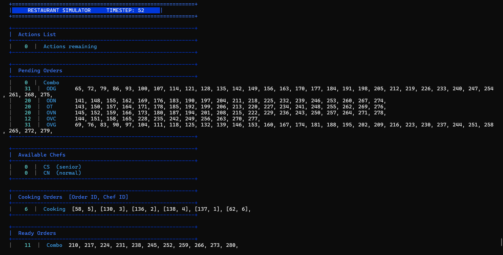
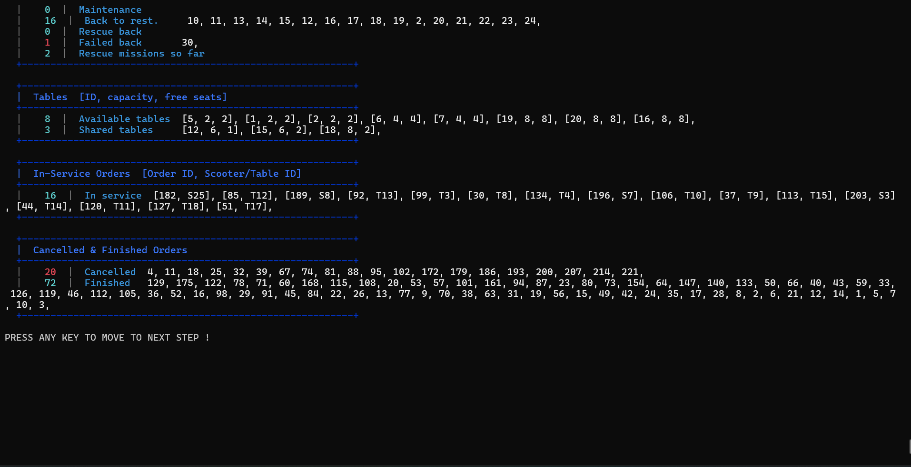
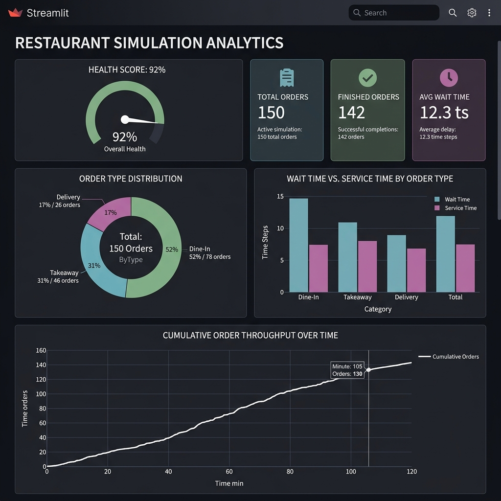

<p align="center">
  
  
  
  
</p>

# 🍽️ RestaurantSim — Restaurant Management Simulation Engine

> A discrete-time simulation engine that models a full restaurant operation — from order intake through kitchen cooking, table seating, and scooter delivery — built entirely on custom **Stacks**, **Queues**, and **Priority Queues**. Zero STL.

**Cairo University · Faculty of Engineering · Computer Engineering Department**  
**Data Structures & Algorithms (CMP G104) — Spring 2026**

---

## 👥 Team

| Name |
|------|
| Mohamed Osama |
| Yousef Sayed  |
| Malak Mohamed |

---

## 📌 Overview

RestaurantSim reads a structured input file describing restaurant resources (chefs, tables, scooters) and a time-sorted ledger of customer actions (order requests & cancellations). The simulation engine processes every order through a **5-stage lifecycle** using carefully chosen data structures, then outputs detailed per-order telemetry and global performance statistics.

The key constraint: **only custom implementations of Stack, Queue, and Priority Queue are allowed** — no STL containers, no global variables, and all entities are tracked via pointers (share & move, never copy).

```
  (Request)         (Assignment)       (Ready)          (Service Start)     (Finish)
    [TQ]                [TA]            [TR]                 [TS]             [TF]
     │                   │               │                    │                │
     ▼                   ▼               ▼                    ▼                ▼
┌──────────┐      ┌──────────┐    ┌──────────┐        ┌────────────┐   ┌──────────┐
│ PENDING  │─────>│ COOKING  │───>│  READY   │───────>│ IN-SERVICE │──>│ FINISHED │
└──────────┘      └──────────┘    └──────────┘        └────────────┘   └──────────┘
```

---

## 🏗️ Architecture

```
RestaurantSim/
├── main.cpp                    # Entry point
├── DEFS.h                      # Program mode enum (Interactive / Silent)
│
├── ds/                         # Custom data structures (from scratch)
│   ├── Node.h                  # Template linked-list node
│   ├── PriNode.h               # Priority node (item + priority)
│   ├── QueueADT.h              # Abstract Queue interface
│   ├── StackADT.h              # Abstract Stack interface
│   ├── LinkedQueue.h           # FCFS linked-list queue
│   ├── ArrayStack.h            # Array-based stack (LIFO)
│   └── PriQueue.h              # Sorted linked-list priority queue
│
├── Derived DS/                 # Specialized structures built on top of base DS
│   ├── derivedQueue.h          # LinkedQueue + mid-queue cancellation by ID
│   ├── CookingOrders.h         # PriQueue + cancellation (for cooking pipeline)
│   └── Fit_Table.h             # PriQueue + best-fit table selection
│
├── entities/                   # Simulation entities
│   ├── Order.h                 # Order base + DineInOrder, DeliveryOrder, TakeawayOrder
│   ├── ComboOrder.h            # Multi-chef, multi-scooter bulk order (bonus)
│   ├── Chef.h                  # CN (Normal) & CS (Special) chefs
│   ├── Scooter.h               # Delivery scooter with maintenance tracking
│   └── Table.h                 # Restaurant table with seat management
│
├── actions/                    # Command pattern for simulation events
│   ├── Action.h                # Abstract base (pure virtual Act())
│   ├── RequestAction.h         # Creates and enqueues new orders
│   └── CancelAction.h         # Cancels OVC orders from any state
│
├── core/                       # Simulation engine & interface
│   ├── Restaurant.h/.cpp       # Central orchestrator (~2000 lines)
│   └── UI.h/.cpp               # Console I/O with ANSI-colored display
│
├── dashboard.py                # Streamlit analytics dashboard (post-sim)
└── input*.txt                  # Test case files (7 scenarios)
```

---

## 🧠 Data Structure Mapping

Every tracking list in the simulation was deliberately mapped to a specific data structure based on its access pattern:

| Tracking List | Data Structure | Why? |
|---|---|---|
| Pending ODG, ODN, OT, OVN | `LinkedQueue` | FCFS — orders served in arrival order |
| Pending OVC | `derivedQueue` | FCFS + need to cancel by ID mid-queue |
| Pending OVG | `priQueue` | Priority dispatch based on `2·price + 2·size − distance` |
| Pending Combo | `LinkedQueue` | FCFS but always assigned before other types |
| Cooking Orders | `CookingOrders` (derived `priQueue`) | Ordered by finish time (peek-only check) + cancellation |
| Ready OD, OT | `LinkedQueue` | FCFS dispatch to tables/pickup |
| Ready OV | `derivedQueue` | FCFS + OVC cancellation support |
| Overwait OVG | `priQueue` | Priority by longest waiting time `(currentTime − TQ)` |
| In-Service Orders | `priQueue` | Ordered by expected finish time — only peek needed |
| Finished Orders | `ArrayStack` | LIFO — print from last finished to first |
| Cancelled Orders | `LinkedQueue` | Maintain cancellation order |
| Available Chefs (CN, CS) | `LinkedQueue` | FCFS chef rotation |
| Free Scooters | `priQueue` | Dispatch scooter with **least distance traveled** |
| Back Scooters | `priQueue` | Ordered by return time to restaurant |
| Maintenance Scooters | `LinkedQueue` | FCFS — first in maintenance, first out |
| Free / Busy Tables | `Fit_Tables` (derived `priQueue`) | **Best-fit** by fewest free seats ≥ required |

---

## ✨ Features

### Core Simulation
- **6 order types**: `ODG`, `ODN` (dine-in), `OT` (takeaway), `OVC`, `OVG`, `OVN` (delivery)
- **Chef assignment logic**: Strict priority hierarchy — dine-in first, then takeaway, then delivery. Special chefs (CS) handle grilled orders, normal chefs (CN) handle the rest, with cross-assignment fallback rules
- **Best-fit table allocation**: Tables sorted by capacity; sharable tables checked first for `CanShare=Y` orders
- **Scooter load balancing**: Scooters dispatched by least aggregate distance traveled
- **OVC cancellation**: Cancel orders from pending, cooking, or ready state — chef freed immediately if mid-cook
- **Takeaway packing delay**: 1-timestep delay after cooking before pickup

### Execution Modes
- **Interactive Mode**: Step-by-step ANSI-colored console output at every timestep
- **Silent Mode**: Runs the full simulation silently, outputs statistics file at the end

### Input Validation
~450 lines of robust validation before the simulation even starts:
- Checks for missing/extra values, negative numbers, duplicate IDs
- Verifies chef/scooter availability for each order type
- Ensures cancellations only target existing OVC orders
- Validates time-ordering of actions

### Output & Statistics
- Per-order log: `TF, ID, TQ, TA, TR, TS, Ti, Tc, Tw, Tserv`
- Global stats: order counts by type, completion/cancellation %, average latencies, chef & scooter utilization %

---

## 🏆 Bonus Features (All 3 Implemented)

### 1. Overwait Monitoring
OVG orders stuck in the ready queue longer than `TH` timesteps get promoted to a **priority overwait list** — they jump ahead of all regular delivery dispatches, sorted by longest total wait `(currentTime − TQ)`.

### 2. Rescue Scooters
- Normal scooters have a **20% chance of failure** during delivery
- When a scooter fails, a **rescue scooter** (3× faster) is dispatched to the failure point to complete the delivery
- The failed scooter returns to base and enters **mandatory maintenance**
- Rescue missions are tracked and reported in statistics

### 3. COMBO Orders
High-volume orders that require:
- **Up to 4 chefs** working in parallel (at least 1 must be CS) — combined cooking speed
- **2+ scooters** for delivery — all dispatched simultaneously
- **Highest assignment priority** — combo orders are always assigned before any other pending type

---

## 📊 Analytics Dashboard

After the simulation completes, a CSV is auto-exported and a **Streamlit + Plotly dashboard** can be launched for visual analysis:







**Dashboard features:**
- Health Score gauge (finished % as KPI)
- Order type distribution (doughnut chart)
- Wait Time vs Service Time comparison (grouped bar chart)
- Cumulative throughput over simulation time (area chart)
- Smart Recommendations Engine — auto-detects bottlenecks (chef shortage, high cancellation rate, delivery-heavy mix)
- Raw data table with search and sort

---

## 🚀 How to Run

### Prerequisites
- **C++ compiler** with C++17 support (Visual Studio 2022 recommended)
- **Python 3.8+** with `streamlit`, `pandas`, `plotly` (for the dashboard only)

### Build & Run
```bash
# Open RestaurantSim.slnx in Visual Studio and build (x64 Release/Debug)
# Or compile manually:
# cl /EHsc /std:c++17 RestaurantSim/main.cpp RestaurantSim/core/Restaurant.cpp RestaurantSim/core/UI.cpp

# Run the simulation
./x64/Debug/RestaurantSim.exe
```

### Simulation Flow
1. Enter input filename (without `.txt` extension)
2. Enter output filename (without `.txt` extension)
3. Select mode: `1` for Interactive, `2` for Silent
4. Step through the simulation (Interactive) or wait for completion (Silent)
5. Optionally launch the analytics dashboard

### Launch Dashboard Separately
```bash
pip install streamlit pandas plotly
cd RestaurantSim
py -m streamlit run dashboard.py
```

---

## 🧪 Test Cases

| File | Actions | Focus |
|------|---------|-------|
| `input1Cancellation.txt` | 50 | Pending-state OVC cancellations |
| `input2RescueScooters.txt` | 100 | Rescue scooter deployment under heavy delivery load |
| `input3TableSharing.txt` | 150 | Dine-in table pressure & sharing logic |
| `input4Maintenance.txt` | 200 | Scooter maintenance cycles (`Main_Ords=2`) |
| `input5Cancellation.txt` | 250 | Cancellation across all states (pending, cooking, ready) |
| `input6Comperhensive.txt` | ~300 | All order types, all features |
| `input7Comperhensive.txt` | ~500 | Large-scale comprehensive stress test |

---

## 📐 Key Formulas

| Metric | Formula | Description |
|--------|---------|-------------|
| Cook Time | `Tc = TR − TA = ⌈size / chefSpeed⌉` | Time spent in the kitchen |
| Idle Time | `Ti = (TA − TQ) + (TS − TR)` | Total time waiting (not cooking or being served) |
| Wait Time | `Tw = Ti + Tc` | Total delay before service begins |
| Service Time | `Tserv = TF − TS` | Time eating at table or scooter in transit |
| Chef Util % | `Σ(chef busy time) / (simTime × chefCount)` | How busy the kitchen was |
| Scooter Util % | `Σ(scooter transit time) / (simTime × scooterCount)` | Fleet utilization rate |

---

## 🛠️ Tech Stack

| Component | Technology |
|-----------|-----------|
| Simulation Engine | C++17 (MSVC) |
| Data Structures | Custom LinkedQueue, ArrayStack, PriQueue — no STL |
| Console UI | ANSI escape codes (colored output) |
| Build System | Visual Studio 2022 (`.slnx`) |
| Analytics Dashboard | Python · Streamlit · Plotly |
| Data Export | CSV (auto-generated after simulation) |

---

<p align="center">
  <sub>Built with ☕ and data structures — Cairo University, Spring 2026</sub>
</p>